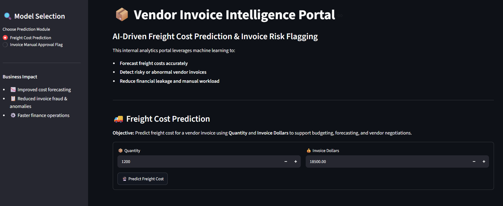
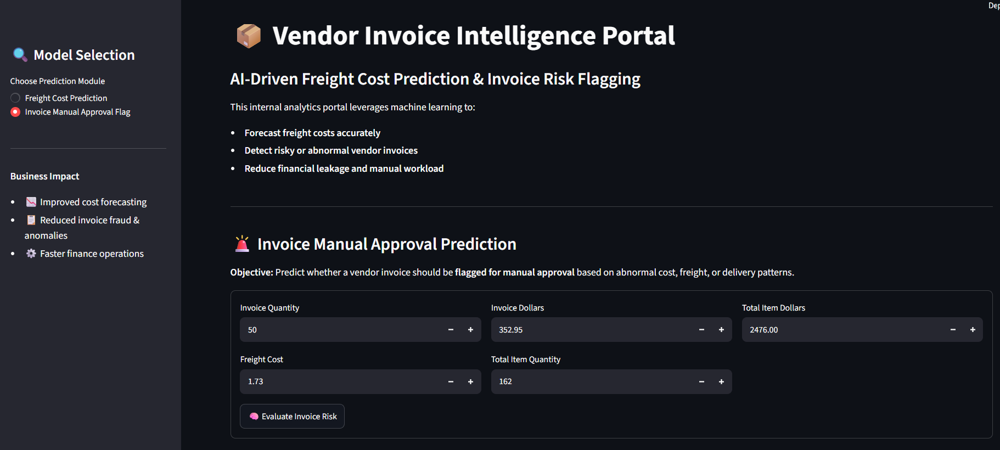

# Vendor Invoice Intelligence System

### AI-Driven Freight Cost Prediction & Invoice Risk Flagging

[](https://invoiceanalysis3304.streamlit.app/)
[](https://drive.google.com/file/d/1o6S9N0j77qM4fd9kbdE2gw2V1TVeh5Ey/view?usp=sharing)
[](https://www.python.org/)
[](LICENSE)
[](https://streamlit.io/)
[](https://scikit-learn.org/)
[](https://www.sqlite.org/)

---

## 🌐 Live Application

> 🚀 **Live Demo URL**: **[https://invoiceanalysis3304.streamlit.app/](https://invoiceanalysis3304.streamlit.app/)**  
> Access the interactive web portal directly in your browser without any local setup.

---

## 📌 Table of Contents

- [Live Application](#-live-application)
- [Project Overview](#-project-overview)
- [Business Objectives](#-business-objectives)
- [Data Sources & Database Download](#-data-sources--database-download)
- [Exploratory Data Analysis & Feature Engineering](#-exploratory-data-analysis--feature-engineering)
- [Models Used](#-models-used)
- [Evaluation Metrics & Results](#-evaluation-metrics--results)
- [Application UI Screenshots](#-application-ui-screenshots)
- [Project Structure](#-project-structure)
- [How to Run This Project](#-how-to-run-this-project)
- [License](#-license)
- [Author & Contact](#-author--contact)

---

## 📌 Project Overview

This project implements an **end-to-end machine learning system** designed to support enterprise finance and procurement operations by:

1. **Predicting expected freight costs** for vendor invoices based on invoice dollar volume and shipment size.
2. **Flagging high-risk vendor invoices** that require manual review and approval due to abnormal financial discrepancies, shipping costs, or operational delivery delays.

```
+---------------------+     +--------------------------+     +-------------------------------+
|  SQLite Database    | --> |  Feature Engineering &   | --> |  Trained ML Models            |
|  (inventory.db)     |     |  Preprocessing Pipeline  |     |  (Regression & Classifier)   |
+---------------------+     +--------------------------+     +-------------------------------+
                                                                             |
                                                                             v
                                                              +-------------------------------+
                                                              |  Interactive Streamlit Portal |
                                                              |  (Real-Time Inference)        |
                                                              +-------------------------------+
```

---

## 🎯 Business Objectives

### 1. Freight Cost Prediction (Regression)
- **Objective**: Predict the expected freight cost for a vendor invoice using quantity, invoice value, and historical shipping behavior.
- **Why it matters**:
  - Freight is a non-trivial component of the total landed cost of goods.
  - Inaccurate freight estimation impacts product margin analysis and quarterly budgeting.
  - Early cost estimation strengthens procurement planning and carrier rate negotiations.

### 2. Invoice Risk Flagging (Classification)
- **Objective**: Automatically detect anomalous or high-risk invoices (e.g., unit-price/dollar mismatches, severe receiving delays) that should be routed for manual review prior to payment.
- **Why it matters**:
  - Prevents financial leakage, invoice overbilling, and erroneous disbursements.
  - Dramatically reduces finance team workload by auto-approving low-risk standard invoices.
  - Accelerates payment cycle times for compliant vendors while enforcing strict compliance on outliers.

---

## 🗄️ Data Sources & Database Download

The project utilizes an internal SQLite database (`inventory.db`) containing comprehensive procurement and supply-chain records:

📥 **Download Database File (`inventory.db`)**:  
👉 **[Google Drive Database Download Link](https://drive.google.com/file/d/1o6S9N0j77qM4fd9kbdE2gw2V1TVeh5Ey/view?usp=sharing)** *(Place downloaded file inside the `data/` folder for local training)*

| Table Name | Description | Key Columns Extracted |
| :--- | :--- | :--- |
| **`vendor_invoice`** | Header-level invoice records submitted by suppliers | `VendorNumber`, `VendorName`, `InvoiceDate`, `PONumber`, `PODate`, `PayDate`, `Quantity`, `Dollars`, `Freight`, `Approval` |
| **`purchases`** | Line-item purchase order details & fulfillment history | `PONumber`, `Brand`, `Quantity`, `Dollars`, `PurchasePrice`, `PODate`, `ReceivingDate` |
| **`purchase_prices`** | Master catalog pricing and brand tier mappings | `Brand`, `Description`, `Price`, `PurchasePrice`, `Classification` |
| **`begin_inventory` / `end_inventory`** | Period warehouse inventory snapshots | `InventoryId`, `Store`, `City`, `Brand`, `onHand`, `Price` |

---

## 📊 Exploratory Data Analysis & Feature Engineering

### 1. Freight Scaling & Volume Analysis
- Analyzed Pearson correlation between `Quantity`, `Dollars`, and `Freight`.
- Engineered `Freight_per_Unit = Freight / Quantity` to observe shipping cost behavior.
- Quartile analysis demonstrated that high-volume shipments (> Q3) benefit from significant per-unit freight cost efficiencies compared to low-volume shipments (< Q1).

### 2. Invoice Discrepancy & Statistical Hypothesis Testing
- Merged purchase order line items with invoice headers via a SQL Common Table Expression (CTE).
- **Engineered Features**:
  - `days_po_to_invoice`: Latency between PO creation and vendor invoice generation.
  - `days_to_pay`: Latency between invoice receipt and payment processing.
  - `total_item_quantity` & `total_item_dollars`: Aggregate item-level order amounts.
  - `avg_receiving_delay`: Mean days elapsed between order date and warehouse receiving date.
- **Ground-Truth Risk Rule (`flag_invoice`)**:
  $$\text{Risk Flag} = 1 \iff |\text{invoice\_dollars} - \text{total\_item\_dollars}| > \$5 \quad \text{OR} \quad \text{avg\_receiving\_delay} > 10\text{ days}$$
- **Welch's Two-Sample T-Tests ($p < 0.05$)**: Validated statistically significant discriminative features separating normal vs. flagged invoices.

---

## 🤖 Models Used

### 1. Freight Cost Prediction (Regression)
- **Linear Regression**: Ordinary Least Squares baseline (Selected as final deployed model due to high interpretability, low MAE, and consistent linear fit).
- **Decision Tree Regressor**: Non-linear tree partitioning.
- **Random Forest Regressor**: Multi-tree ensemble.

### 2. Invoice Risk Classification
- **Logistic Regression**: Baseline linear classification with standardized features.
- **Decision Tree Classifier**: Rule-based non-linear tree classifier.
- **Random Forest Classifier with `GridSearchCV`**: Optimized multi-tree ensemble tuned over 5-fold cross-validation with an `f1_score` objective.

---

## 📈 Evaluation Metrics & Results

### Freight Cost Prediction (Regression)
| Model | MAE ($) | RMSE ($) |
| :--- | :---: | :---: |
| **Linear Regression (Best Model)** | **$24.11** | **$124.72** |
| Random Forest Regressor | $26.13 | $134.79 |
| Decision Tree Regressor | $32.97 | $150.31 |

### Invoice Risk Classification (Classification)
| Model | Accuracy | Precision (Flagged) | Recall (Flagged) | F1-Score (Flagged) |
| :--- | :---: | :---: | :---: | :---: |
| **Tuned Random Forest (Best)** | **89.0%** | **0.96** | **0.69** | **0.80** |
| Decision Tree Classifier | 87.2% | 0.81 | 0.74 | 0.77 |
| Logistic Regression | 84.1% | 0.76 | 0.65 | 0.70 |

---

## 💻 Application UI Screenshots

An interactive web application built with **Streamlit** provides real-time inference for both prediction modules.

### 1. Freight Cost Prediction Module (UI)
Users enter the shipment **Quantity** and **Invoice Dollars** to estimate expected freight charges.



<br>

---

### 2. Invoice Risk & Manual Approval Flag Module (UI)
Users input invoice details (**Invoice Quantity**, **Invoice Dollars**, **Freight**, **Total Item Quantity**, and **Total Item Dollars**) to evaluate whether the invoice is **Safe for Auto-Approval** or **Requires Manual Approval**.



<br>

---

## 📁 Project Structure

```
INVOICE/
├── app.py                             # Streamlit interactive web portal
├── requirements.txt                   # Project dependencies
├── README.md                          # Project documentation
├── LICENSE                            # MIT License
├── .gitignore                         # Git ignore configuration
│
├── data/
│   └── .gitkeep                       # Placeholder for inventory.db database
│
├── images/
│   ├── freight_prediction_ui.png      # UI screenshot for Freight Prediction
│   └── invoice_risk_flagging_ui.png   # UI screenshot for Invoice Risk Flagging
│
├── notebooks/
│   ├── fileone.ipynb                  # EDA & Freight Cost Prediction Modeling
│   └── filetwo.ipynb                  # EDA & Invoice Risk Classification Modeling
│
├── freight_cost_prediction/
│   ├── data_preprocessing.py          # Data ingestion & feature selection for freight
│   ├── model_evaluation.py            # Training routines & regression evaluation metrics
│   ├── train.py                       # Pipeline to train and export freight model
│   └── models/
│       └── predict_freight_cost_model.pkl  # Serialized best regression model
│
├── invoice_flagging/
│   ├── data_preprocessing.py          # CTE queries, labeling, split & feature scaling
│   ├── model_evaluation.py            # GridSearch tuning & classification evaluation
│   ├── train.py                       # Pipeline to train and export classifier + scaler
│   └── models/
│       ├── predict_flag_invoice.pkl   # Serialized Random Forest classifier
│       └── scaler.pkl                 # Fitted StandardScaler artifact
│
└── inference/
    ├── freight_predict.py             # Inference module for freight cost prediction
    └── invoice_flag.py                # Inference module for invoice risk evaluation
```

---

## 🚀 How to Run This Project

### 1. Activate Virtual Environment
Make sure your virtual environment (`.venv`) is activated in PowerShell:
```powershell
# Activate virtual environment in PowerShell
.\.venv\Scripts\Activate.ps1
```

### 2. Install Dependencies
```powershell
pip install -r requirements.txt
```

### 3. (Optional) Download Database for Local Retraining
Download [`inventory.db`](https://drive.google.com/file/d/1o6S9N0j77qM4fd9kbdE2gw2V1TVeh5Ey/view?usp=sharing) and place it inside the `data/` directory.

To retrain and serialize the models:
```powershell
# Train Freight Cost Prediction Model
python freight_cost_prediction/train.py

# Train Invoice Risk Classification Model
python invoice_flagging/train.py
```

### 4. Launch Streamlit Web Application Locally
Run Streamlit using any of the following commands:

```powershell
# Option A: Direct Streamlit command (when .venv is activated)
streamlit run app.py

# Option B: Run via Python executable in .venv
.\.venv\Scripts\python.exe -m streamlit run app.py

# Option C: Direct path to streamlit executable
.\.venv\Scripts\streamlit.exe run app.py
```

Once launched, open your browser at:
👉 **`http://localhost:8501`**

---

## 📄 License

This project is licensed under the MIT License - see the [LICENSE](LICENSE) file for details.

---

## 👤 Author & Contact

- **Author**: Nilesh Jadhav
- **Project**: Vendor Invoice Intelligence System
- **Live App**: [invoiceanalysis3304.streamlit.app](https://invoiceanalysis3304.streamlit.app/)
- **Repository**: [Invoice_Analysis](https://github.com/NileshJadhav1312/Invoice_Analysis.git)
